Das Modul ermöglicht das Hinzufügen von Aktivitäts-, Verlaufs- und Aufgaben-Blöcken zu jeder Entität (einschließlich selbstangelegter Aktivitäten) und zeigt diese im rechten Bereich des detaillierten Layouts dieser Entität an. 

Dafür erstellt das Modul alle notwendigen Verknüpfungen zwischen den beteiligten Entitäten und ändert automatisch die Konfiguration des Seitenpanel-Layouts für die entsprechende Entität.

## Installationsanleitung

- Um das Modul zu installieren, öffnen Sie in der Administration den Modulmanager und führen Sie die Installation durch.
  
- Um das Modul zu deaktivieren, deaktivieren Sie die Checkbox "Is active".
- Um das Modul zu deinstallieren, wählen Sie die Option "Remove" aus dem Aktionsmenü des Moduls.

## Administrator-Funktionen 
- Nach der Installation des Moduls in den Einstellungen der einzelnen Entitäten können Sie einzelne Aktivitäten und Aufgaben aktivieren oder deaktivieren. Falls diese aktiviert sind, werden die Aktivitäten und Aufgaben inkl. der ganzen Historie in dem rechten Seitenpanel angezeigt.

- Um Aktivitäten und/oder Aufgaben in einer Entität zu aktivieren:

1. Öffnen Sie in der Administration den Entity Manager und gehen Sie zu den Einstellungen der Entität, in der die Aktivitäten zu aktivieren sind, indem Sie auf "Edit" klicken.

2. Bei den Einstellungen setzen Sie die Checkbox bei den "Aktivitäten", wenn Sie die Blöcke für Verwaltung der Anrufe, Besprechungen und E-Mails aktivieren  möchten. Setzen Sie die Checkbox bei den Aufgaben, um die Verwaltung der mit der jeweiligen Entität verbundenen Aufgaben zu ermöglichen. 

  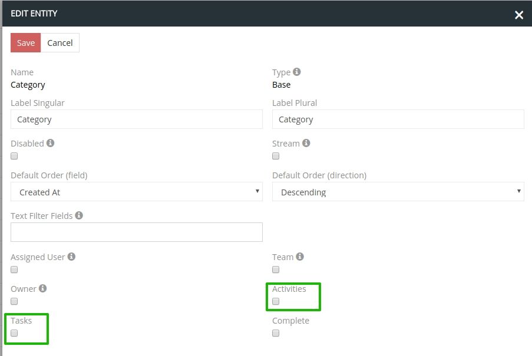

#### Konfiguration der Zugriffsrechte für Benutzer

Damit die Benutzer Aktivitäten und Aufgaben nutzen können, konfigurieren Sie bitte für diese die Zugriffsrechte auf die folgenden Entitäten:

- Anrufe
- Besprechungen
- Aufgaben
- E-Mails

## Benutzer-Funktionen

Nach der Aktivierung von Aktivitäten und Aufgaben erscheinen im rechten Seitenpanel folgende Blöcke: 

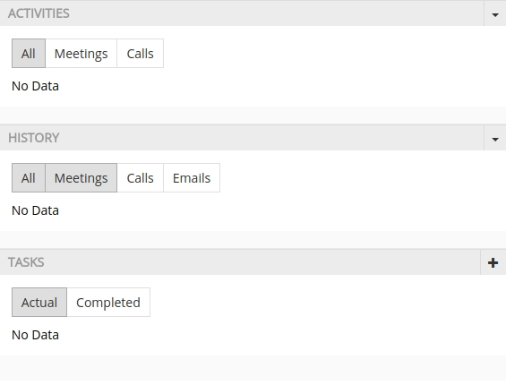

### Das Seitenpanel für Aktivitäten

- Auf dem Seitenpanel für Aktivitäten kann man die Einträge für alle Arten von Aktivitäten oder gefiltert nach Besprechungen oder Anrufen sehen, indem Sie auf den entsprechenden Button klicken. Standardmäßig werden alle Aktivitäten angezeigt. 

  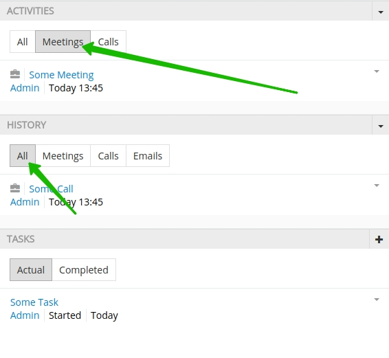
  
- Um eine neue Aktivität zu erstellen, klicken Sie auf den Select-Icon im Aktionsmenü in der oberen rechten Ecke des Panels und wählen Sie die entsprechende Aktion aus. 

  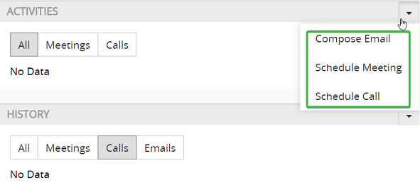
  
- Um eine neue E-Mail zu erstellen und zu senden, wählen Sie aus dem Aktionsmenü den Punkt `Compose Email`.
  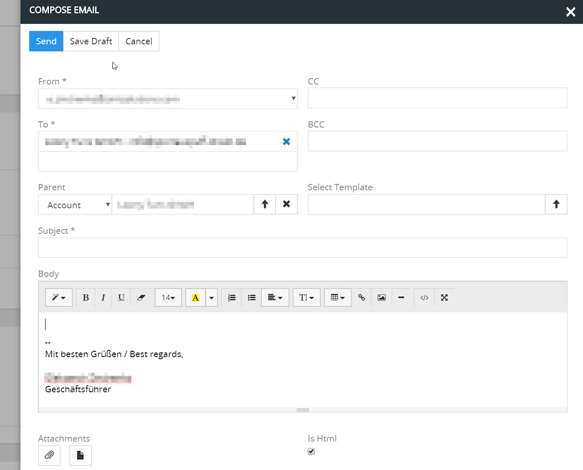
- Um einen neuen Anruf zu erstellen, wählen Sie `Schedule Call`.
  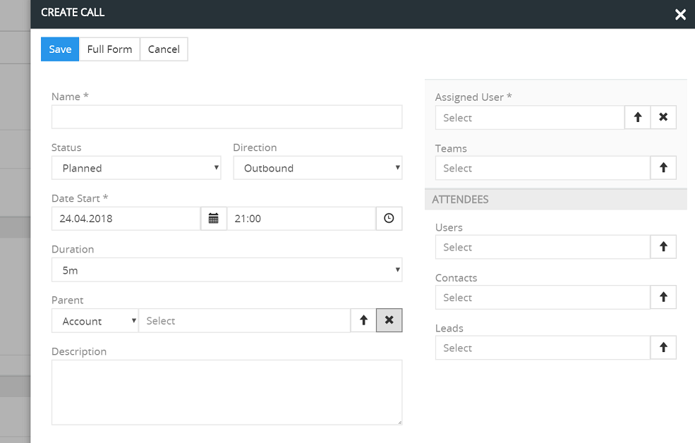
- Um eine neue Besprechung zu erstellen, wählen Sie `Schedule Meeting`.
  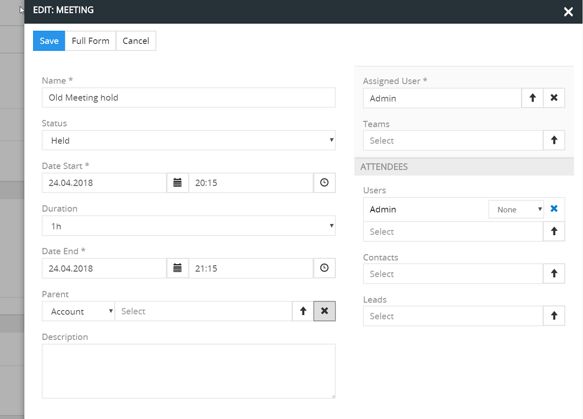
- Um detaillierte Informationen zu einer bestimmten Entität anzuzeigen, klicken Sie auf den Namen dieser Aktivität. 
- Um einen Eintrag schnell in einem Pop-up anzuzeigen, klicken Sie auf "View" im Aktionsmenü für den einzelnen Eintrag.
- Um einen Eintrag in einem Pop-up schnell zu bearbeiten, klicken Sie auf "Edit" im Aktionsmenü für den einzelnen Eintrag.
- Um einen Eintrag zu löschen, klicken Sie auf "Remove" im Aktionsmenü dieses Eintrags.
- Es besteht die Möglichkeit, eine bestimmte Aktivität (Anruf oder Besprechung) als stattgefunden oder nicht stattgefunden zu markieren, dazu müssen Sie die entsprechende Option aus dem Aktionsmenü wählen. 
  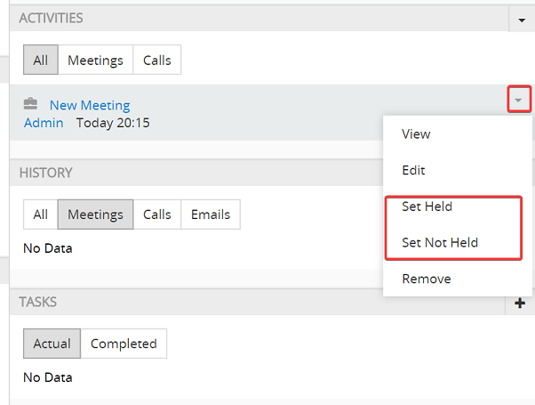

### Seitenpanel für Historie

- Auf dem Seitenpanel für Historie wird der Verlauf aller Aktivitäten (Standardeinstellung) angezeigt. 
- Um die Historie nach einem bestimmten Aktivitätstyp zu filtern, klicken Sie auf den Button Meetings, Calls oder E-Mails entsprechend. 
- Um Informationen zu einem Anruf, einer Besprechung oder eine schon versendete E-Mail zu speichern, klicken Sie auf den Select-Icon oben rechts und wählen Sie die entsprechende Option. 
  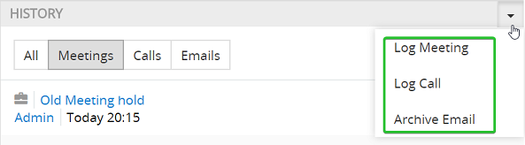
- Um detaillierte Informationen zu einer bestimmten Aktivität anzuzeigen, klicken Sie auf den Namen dieser Aktivität.
- Für jeden Aktivitäten-Eintrag aus der Historie sind folgende Aktionen vorhanden: Schnelle Ansicht des Eintrags, schnelle Bearbeitung des Eintrags und Löschen des Eintrags. 

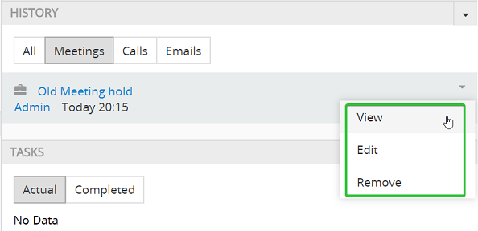

### Seitenpanel für Aufgaben

- Auf dem Seitenpanel für Aufgaben werden die aktuellen und abgeschlossenen Aufgaben aufgelistet, mit der Angabe der Aufgabenbezeichnung, Status, verantwortlichen Mitarbeiters und des Fälligkeitsdatums.

  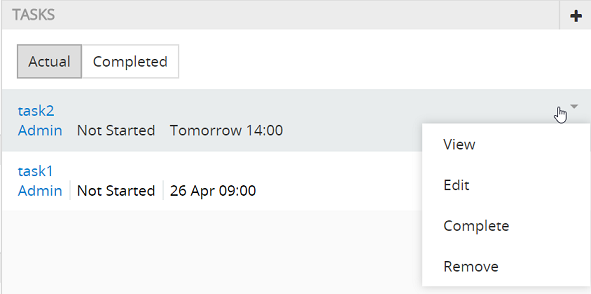

- Im Aktionsmenü für jeden einzelnen Eintrag sind folgende Optionen möglich: Aufgabenansicht, Aufgabenbearbeitung, Aufgabe als erledigt markieren, Aufgabe löschen. 

- Um schnell einen neuen Aufgabeneintrag zu erstellen, klicken Sie auf das "+" Icon in der oberen rechten Ecke. 
  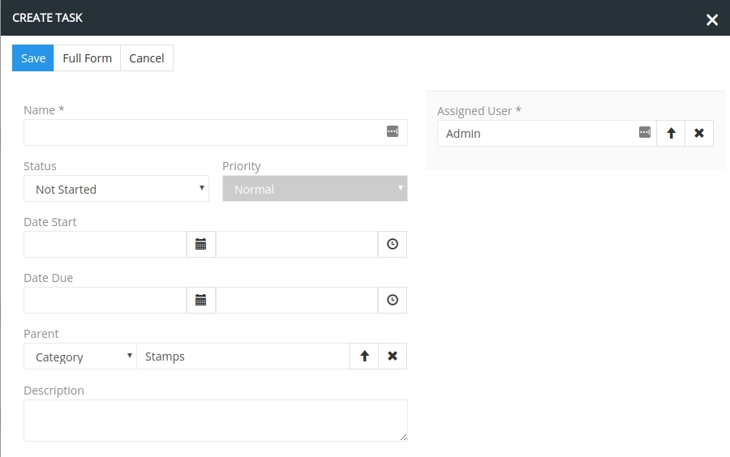
