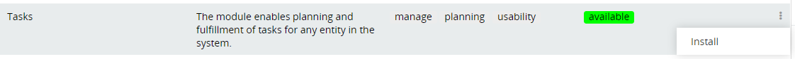
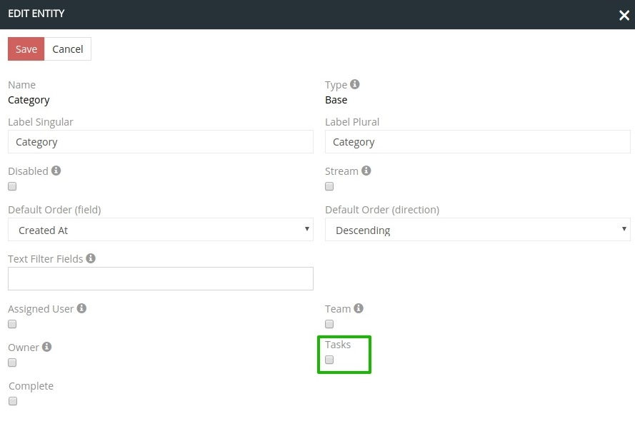
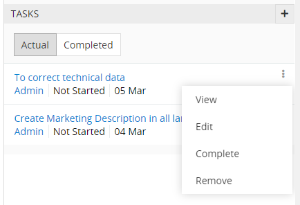
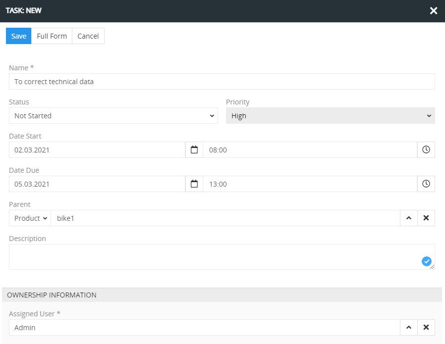
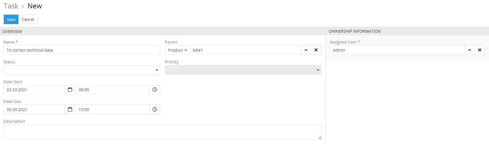
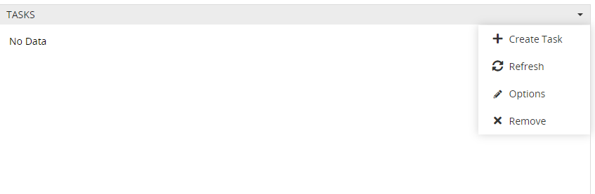

Das Modul ermöglicht das Hinzufügen von Aktivitäts-, Verlaufs- und Aufgaben-Blöcken zu jeder Entität (einschließlich selbstangelegter Aktivitäten) und zeigt diese im rechten Bereich des detaillierten Layouts dieser Entität an. 

Dafür erstellt das Modul alle notwendigen Verknüpfungen zwischen den beteiligten Entitäten und ändert automatisch die Konfiguration des Seitenpanel-Layouts für die entsprechende Entität.

## Installationsanleitung

Um das Modul zu installieren, öffnen Sie in der Administration den Modulmanager und führen Sie die Installation durch.

Um das Modul zu aktualisieren, wählen Sie die Option "Update" aus dem Aktionsmenü des Moduls und klicken Sie anschließend auf den Knopf auf "Run Update".
Um das Modul zu deinstallieren, wählen Sie die Option "Remove" aus dem Aktionsmenü des Moduls.

## Administrator-Funktionen 
Nach der Installation des Moduls in den Einstellungen der einzelnen Entitäten können Sie einzelne Aufgaben aktivieren oder deaktivieren. Falls diese aktiviert sind, werden die Aufgaben inkl. der ganzen Historie in dem rechten Seitenpanel angezeigt.

Um Aufgaben in einer Entität zu aktivieren:

1. Öffnen Sie in der Administration den Entity Manager und gehen Sie zu den Einstellungen der Entität, in der die Aktivitäten zu aktivieren sind, indem Sie auf "Edit" klicken.

2. Bei den Einstellungen setzen Sie die Checkbox bei den Aufgaben, um die Verwaltung der mit der jeweiligen Entität verbundenen Aufgaben zu ermöglichen. 

#### Konfiguration der Zugriffsrechte für Benutzer

Damit die Benutzer die Aufgaben nutzen können, konfigurieren Sie deren Zugriffsrechte auf die Entität "Tasks".

## Benutzer-Funktionen

Nach der Aktivierung der Aufgaben erscheinen im rechten Seitenpanel folgende Box: 

### Seitenpanel für Aufgaben

Auf dem Seitenpanel für Aufgaben werden die aktuellen und abgeschlossenen Aufgaben aufgelistet, mit der Angabe der Aufgabenbezeichnung, Status, verantwortlichen Mitarbeiters und des Fälligkeitsdatums.

Im Aktionsmenü für jeden einzelnen Eintrag sind folgende Optionen möglich: Aufgabenansicht, Aufgabenbearbeitung, Aufgabe als erledigt markieren, Aufgabe löschen. 

Um schnell einen neuen Aufgabeneintrag zu erstellen, klicken Sie auf das "+" Icon in der oberen rechten Ecke. 

Es ist möglich, die Aufgaben auch im Hauptfenster zu sehen oder editieren, dafür sollte man auf dem Knopf "Full Form" oben links klicken. 

  
### Dashboard Widget for Tasks
  
Der Benutzer kann ein Dashlet auf dem Dashboard hinzufügen, um eigene Aufgaben zu sehen.

